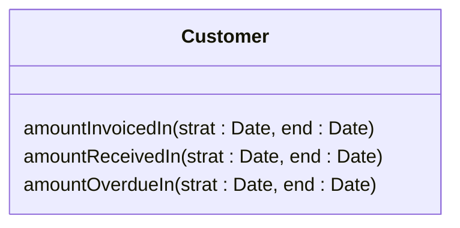
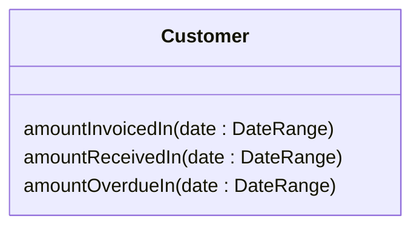

# Introduce Parameter Object

### Problem

Your methods contain a repeating group of parameters.

### Solution

Replace these parameters with an object.

### Why Refactor

Identical groups of parameters are often encountered in multiple
methods. This causes code duplication of both the parameters themselves and of related operations. By consolidating parameters in a single class, you can also move the methods for handling this data there as well, freeing the other methods from this code.

### Benefits

- More readable code. Instead of a hodgepodge of parameters, you see a single object with a comprehensible name.

- Identical groups of parameters scattered here and there create their own kind of code duplication: while identical code isn't being called, identical groups of parameters and arguments are constantly encountered.

### Drawbacks

- If you move only data to a new class and don't plan to move any behaviors or related operations there, this begins to smell of a [[Develop/_commons/fruit/smells/dispensables/data-class|Data Class]].

### How to Refactor

1. Create a new class that will represent your group of parameters. Make the class immutable.

2. In the method that you want to refactor, use [[add-parameter|Add Parameter]], which is where your parameter object will be passed. In all method calls, pass the object created from old method parameters to this parameter.

3. Now start deleting old parameters from the method one by one, replacing them in the code with fields of the parameter object. Test the program after each parameter replacement.

4. When done, see whether there's any point in moving a part of the method (or sometimes even the whole method) to a parameter object class. If so, use [[move-method|Move Method]] or [[extract-method|Extract Method]].
