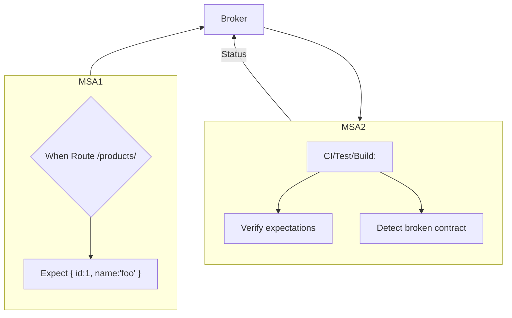
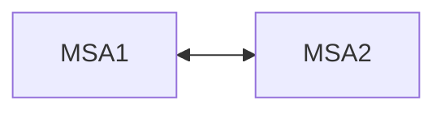

## ⚪ ️2.3 Ensure new releases don’t break the API using contract tests

:white_check_mark: **Do:** So your Microservice has multiple clients, and you run multiple versions of the service for compatibility reasons (keeping everyone happy). Then you change some field and ‘boom!’, some important client who relies on this field is angry. This is the Catch-22 of the integration world: It’s very challenging for the server side to consider all the multiple client expectations — On the other hand, the clients can’t perform any testing because the server controls the release dates. There is a spectrum of techniques that can mitigate the contract problem, some are simple, other are more feature-rich and demand a steeper learning curve. In a simple and recommended approach, the API provider publishes npm package with the API typing (e.g. JSDoc, TypeScript). Then the consumers can fetch this library and benefit from codign time intellisense and validation. A fancier approach is to use [PACT](https://docs.pact.io/) which was born to formalize this process with a very disruptive approach — not the server defines the test plan itself rather the client defines the tests of the… server! PACT can record the client expectation and put it in a shared location, “broker”, so the server can pull the expectations and run on every build using the PACT library to detect broken contracts — a client expectation that is not met. By doing so, all the server-client API mismatches are caught early during build/CI and might save you a great deal of frustration
 

❌ **Otherwise:** The alternatives are exhausting manual testing or deployment fear

 

✏ <b>Code Examples</b>

 

### :clap: Doing It Right Example:

<!-- BROKEN IMAGE:  -->

  

### Deployment Test

### Production Time
